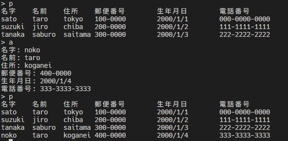

# 住所録プログラム

## 機能

- 読み込み
- 書き込み
- 登録(データの追加)
- 編集
- 削除
- 検索

## データ1つのパラメータ

- 苗字
- 名前
- 住所
- 郵便番号
- 生年月日
- 電話番号

## コマンド

|機能|コマンド|
|:--:|:--:|
|読み込み|r|
|表示|p|
|保存|s|
|追加|a|
|削除|d|
|検索|f|
|終了|e|

## 住所録のデータの保存形式について

CSV 形式でデータを保存します。
CSV 形式とは、**カンマ区切り**の**テキストファイル**のことです。

エクセルで開くとカンマで区切ってセルごとにデータが表示されます。

以下は CSV の例です。address.csv というファイルに保存されています。

```
sato,taro,tokyo,100-0000,2000/1/1,000-0000-0000
suzuki,jiro,chiba,200-0000,2000/1/2,111-1111-1111
tanaka,saburo,saitama,300-0000,2000/1/3,222-2222-2222
```

## 連結リスト

連結リストとは、データを格納するためのデータ構造の一つです。
連結リストは、データを格納するためのノードと呼ばれる構造体を用意し、ノード同士をリンクさせてデータを格納します。

以下は、連結リストの例です。


## データの読み込み

CSV 形式のファイルを読み込みます。
例として `address.csv` というファイルを読み込む場合は、以下のようにします。


readData 関数でファイルを読み込んで、連結リストを生成しています。

`%[^,],%[^,],%[^,],%[^,],` ←こんな感じのフォーマット指定子を使うと、カンマ区切りの CSV ファイルを読み込むことができます。

## データの表示

連結リストのデータを表示します。

以下の画像では、 r でデータを読み込んだあと、 p でデータを表示しています。


## データの保存

連結リストのデータを CSV 形式で保存します。

以下の画像では、 s でデータを保存しています。


`new_address.csv` というファイルが生成されていることがわかります。


## データの追加

連結リストにデータを追加します。

以下の画像では、 a でデータを追加して、 p で表示しています。



## データの削除

連結リストからデータを削除します。

以下の画像では、 p で削除前に表示して、 d でデータを削除して、 p で表示しています。


## データの検索

連結リストからデータを検索します。

以下の画像では、 p で検索前に表示して、 f でデータを検索しています。


## 終了

プログラムを終了します。

以下の画像では、 e でプログラムを終了しています。


## まとめ

連結リストを使って、住所録プログラムを作成しました。

詳しい説明はだいぶ省いてます。

(c) sugawa197203 2023